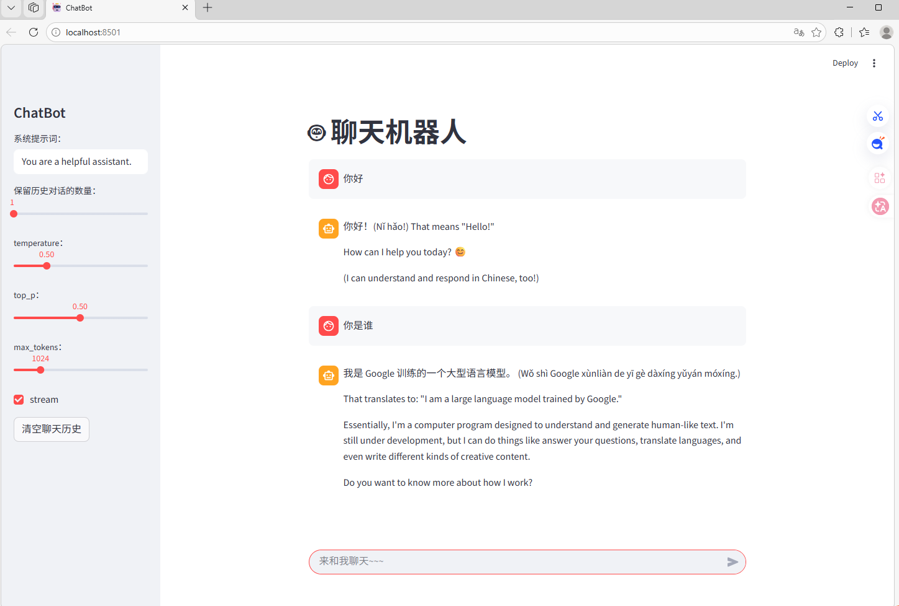
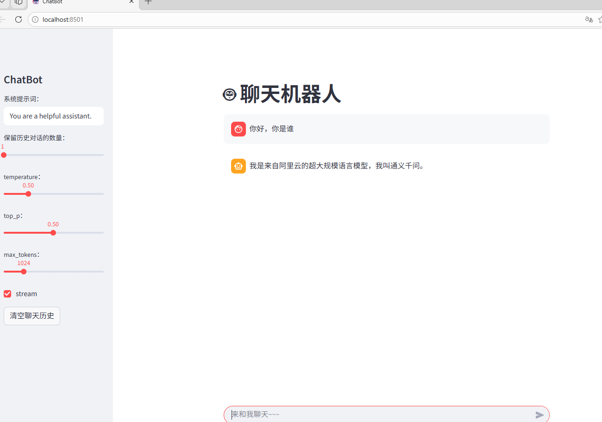
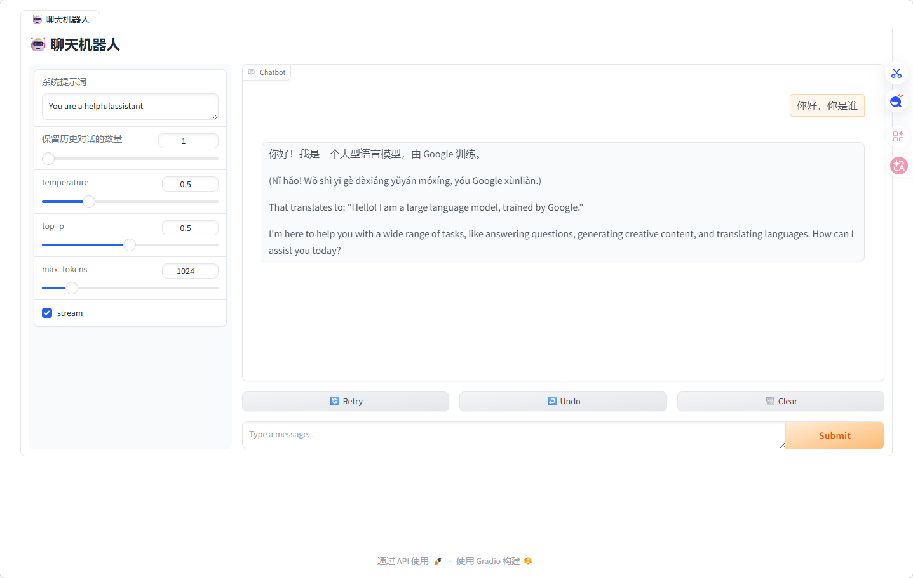
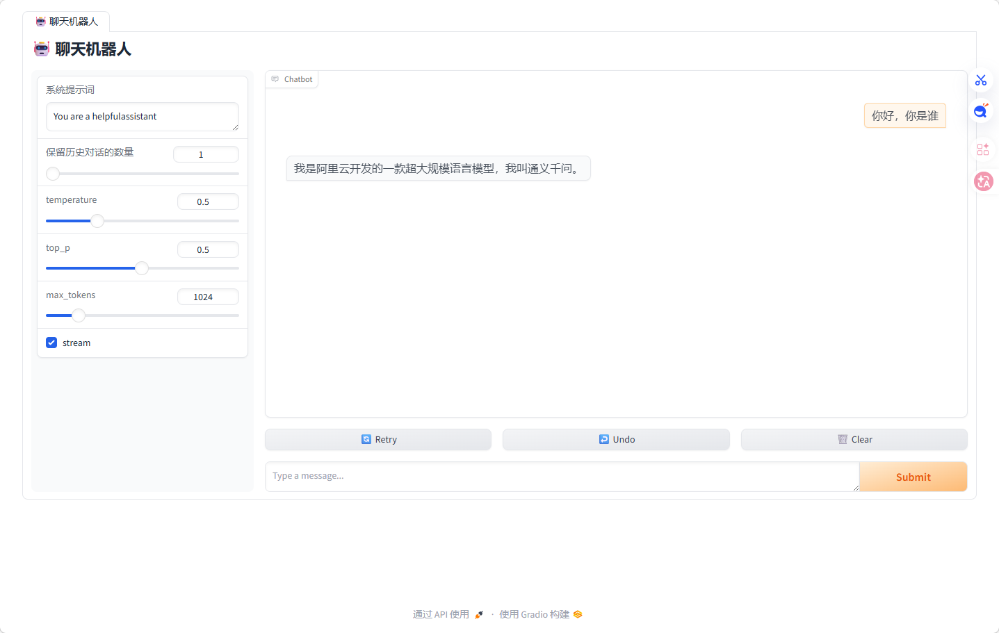

# Qwen2.5-0.5B-Instruct和gemma3:4b模型应用
该仓库没有Qwen2.5-0.5B-Instruct和gemma3:4b模型，请自行下载
## 1.模型介绍
### Qwen2.5-0.5B-Instruct模型
Qwen2.5 是 Qwen 大型语言模型的最新系列。
对于 Qwen2.5，我们发布了从 0.5 到 720 亿参数不等的一系列基础语言模型和指令调优语言模型

### gemma3:4b模型
Gemma3是Google最新的开源权重大模型系列。
它有四种尺寸：10 亿、40 亿、120 亿和270 亿参数，并提供基础（预训练）和指令微调版本。
Gemma 3 实现了多模态！40 亿、120 亿和 270 亿参数的模型可以处理图像和文本，而 10 亿参数的版本仅支持文本。
与 Gemma 2 的 8k 相比，10 亿参数版本的输入上下文窗口长度已增加到32k，其他版本增加到128k。
与其他视觉语言模型 (VLM) 一样，Gemma 3 会根据用户输入（可能包含文本和可选的图像）生成文本。
示例用途包括问答、分析图像内容、总结文档等。


## 2.模型下载
### Qwen2.5-0.5B-Instruct模型
Qwen2.5模型下载来源于魔搭社区
先安装魔搭社区  
```
pip install modelscope==1.18.1
```  
然后进行模型下载，通过Python文件下载  
```
from modelscope.hub.snapshot_download import snapshot_download
llm_model_dir = snapshot_download('Qwen/Qwen2.5-0.5B-Instruct',cache_dir='models')
```
完成模型下载
### gemma3:4b模型
gemma3模型下载可以用ollama来了进行下载
首先先访问ollama官网，进行下载ollama安装包  
https://ollama.ai/download  
或者通过命令行进行下载
```
irm https://ollama.com/install.ps1 | iex
```
下载完毕，进行ollama安装
ollama是安装到c盘中，默认安装路径为C:\Users\用户名\AppData\Local\ollama
如果要修改路径，可以看
https://www.cnblogs.com/LaiYun/p/18696931z
来进行文件移动  
接下来是模型下载，有两种方法进行模型下载
1. 使用ollama命令行进行模型下载
2. 打开ollama界面，选择模型，通过交流，会自行进行下载
完成模型下载

## 3.模型应用
根据实验案例，有多个模型应用，模型应用如下：
### 3.1 OpenAI形式访问ollama大模型API
安装相应的包
```
pip install openai==1.71.0
```
创建一个文件，run_api.py文件，此文件在Test3里
```python
from openai import OpenAI
#加载本地的大模型服务
api_key = 'ollama'
base_url = 'http://localhost:11434/v1'
client = OpenAI(api_key=api_key, base_url=base_url)
# 发送请求到大模型, 流式输出
response = client.chat.completions.create(model='gemma3:4b', # 使用的模型，可以自行选择
    messages=[{"role": "system", "content": "You are a helpful assistant."},
    {"role": "user", "content": "你好，你是谁"},],
    max_tokens=150, # 返回文本的最大长度
    temperature=0.7, # 控制生成文本的随机性，值越低，输出越确定
    stream=True)
# 逐块打印返回结果
for chunk in response:
    print(chunk.choices[0].delta.content)

# # 发送请求到大模型, 非流式输出
response = client.chat.completions.create(
model='gemma3:4b', # 使用的模型，可以自行选择
messages=[
{"role": "system", "content": "You are a helpful assistant."},
{"role": "user", "content": "你好,你是谁"},
],
max_tokens=150, # 返回文本的最大长度
temperature=0.7, # 控制生成文本的随机性，值越低，输出越确定
stream=False
)
print(response.choices[0].message.content)
```
这样可以访问ollama中的大模型

### 3.2 对话机器人fastapi（后端）
#### 简绍
FastAPI 是一个用于构建API的现代化、快速（高性能）的Web框架，
使用Python 3.7+的标准类型提示。它的性能媲
美Node.js和Go，是基于Python的框架中最快的之一。
#### 主要特点
- 高性能：与Starlette、Pydantic等框架深度集成，性能优异。
- 简洁明了：基于类型提示（Type Hints），使得代码更加简洁且具备良好的可读性。
- 自动生成文档：自动生成Swagger UI和ReDoc文档，方便开发者查看和测试API。
- 异步支持：原生支持Python的async和await，适合处理异步任务。

#### 模型应用
首先安装fastapi模块
```
pip install fastapi==0.115.12
pip install uvicorn==0.34.0
```
然后创建一个文件，backend.py文件,此文件在Test4里
```python
#导入相应的库
from fastapi import FastAPI, Body
from openai import AsyncOpenAI
from typing import List
from fastapi.responses import StreamingResponse
# 初始化FastAPI应用
app = FastAPI()
# 初始化openai的客户端
api_key = 'ollama'
base_url = 'http://localhost:11434/v1'
aclient = AsyncOpenAI(api_key=api_key, base_url=base_url)

# 初始化对话列表
messages = []
# 定义路由，实现接口对接
@app.post("/chat")
async def chat(
query: str = Body(..., description="用户输入"),
sys_prompt: str = Body("你是一个有用的助手。", description="系统提示词"),
history: List = Body([], description="历史对话"),
history_len: int = Body(1, description="保留历史对话的轮数"),
temperature: float = Body(0.5, description="LLM采样温度"),
top_p: float = Body(0.5, description="LLM采样概率"),
max_tokens: int = Body(None, description="LLM最大token数量")):
    global messages
# 控制历史记录长度
    if history_len > 0:
        history = history[-2 * history_len:]
# 清空消息列表
    messages.clear()
    messages.append({"role": "system", "content": sys_prompt})
# 在message中添加历史记录
    messages.extend(history)
    # 在message中添加用户的prompt
    messages.append({"role": "user", "content": query})
# 发送请求
    response = await aclient.chat.completions.create(
        model="gemma3:4b",
        messages=messages,
        max_tokens=max_tokens,
        temperature=temperature,
        top_p=top_p,
        stream=True
        )
# 响应流式输出并返回
    async def generate_response():
        async for chunk in response:
            chunk_msg = chunk.choices[0].delta.content
            if chunk_msg:
                yield chunk_msg
    # 流式的响应fastapi的客户端
    return StreamingResponse(generate_response(), media_type="text/plain")
if __name__ == "__main__":
    import uvicorn
    uvicorn.run(app, host="127.0.0.1", port=6066, log_level="info")
```
运行backend.py文件，启动后端服务，端口为6066

### 3.3 对话机器人streamlit（前端）
Streamlit 是一个非常方便的 Python 库，用来快速构建数据驱动的 Web 应用。
在这个项目中，Streamlit 将用于展示聊天界面并与后端进行交互。
[官网](https://docs.streamlit.io/develop/api-reference)

#### 应用
先安装streamlit模块
```
pip install streamlit==1.39.0
```
然后创建一个文件，frontend.py文件,此文件在Test5里
```python
#导入相应的库
import streamlit as st
import requests
# 定义fastapi后端服务器地址
backend_url = "http://127.0.0.1:6066/chat"
# 设计页面
st.set_page_config(page_title="ChatBot", page_icon="🤖", layout="centered")#标题、图标、布局居中
# 设计聊天对话框
st.title("🤖 聊天机器人")
# 清空聊天历史
def clear_chat_history():
    st.session_state.history = []
# st.sidebar负责设计侧边栏
with st.sidebar:
    st.title("ChatBot")
    sys_prompt = st.text_input("系统提示词：", value="You are a helpful assistant.") #创建一个文本输入框，允许用户输入单行文本
    history_len = st.slider("保留历史对话的数量：", min_value=1, max_value=10, value=1, step=1)
    # 滑动条
    temperature = st.slider("temperature：", min_value=0.01, max_value=2.0, value=0.5,
    step=0.01)
    top_p = st.slider("top_p：", min_value=0.01, max_value=1.0, value=0.5, step=0.01)
    max_tokens = st.slider("max_tokens：", min_value=256, max_value=4096, value=1024,
    step=8)
    stream = st.checkbox("stream", value=True) # 复选框
    st.button("清空聊天历史", on_click=clear_chat_history) # 按钮
# 定义存储历史
if "history" not in st.session_state:
    st.session_state.history = []
    # 显示聊天历史
for message in st.session_state.history:
    with st.chat_message(message["role"]):
        st.markdown(message["content"])
# 输入框
# 海象运算符（:=）， 用于检查赋值的内容（prompt）是否为空
if prompt := st.chat_input("来和我聊天~~~"):
# 显示用户消息
    with st.chat_message("user"):
        st.markdown(prompt)
# 构建请求数据
    data = {
    "query": prompt,
    "sys_prompt": sys_prompt,
    "history_len": history_len,
    "history": st.session_state.history,
    "temperature": temperature,
    "top_p": top_p,
    "max_tokens": max_tokens
    }
# 发送请求到fastapi后端
    response = requests.post(backend_url, json=data, stream=True)
    if response.status_code == 200:
        chunks = ""
        assistant_placeholder = st.chat_message("assistant")
        assistant_text = assistant_placeholder.markdown("")
        if stream: # 流式输出
            for chunk in response.iter_content(chunk_size=None, decode_unicode=True):
                # 处理响应的内容，并累加起来
                chunks += chunk
                # 实时显示和更新助手的消息
                assistant_text.markdown(chunks)
        else:
            for chunk in response.iter_content(chunk_size=None, decode_unicode=True):
                chunks += chunk
            assistant_text.markdown(chunks)
        st.session_state.history.append({"role": "user", "content": prompt})
        st.session_state.history.append({"role": "assistant", "content": chunks})
```
建立两个终端，分别运行backend.py和frontend.py文件
其界面如下：  
  
这个是gemma3:4b模型  
   
这个是Qwen2.5-0.5B-Instruct模型模型  

### 3.4 对话机器人gradio（前端）
Gradio 是一个简单易用的 Python 库，能够帮助开发者快速搭建用户友好的 Web 应用，特别适合用于机器学习模型
的展示。本课程将使用 Gradio 来搭建一个可以与FastAPI 后端交互的对话机器人。  
gradio核心组件  
Gradio Blocks：用于组织界面布局的容器。  
Slider：用于调整生成参数，如 temperature 和 top_p。  
Textbox：用户输入对话的地方。  
Button：发送用户输入或清空历史记录。  
Chatbot：用于显示对话历史的组件  
#### 应用
安装模块
```
pip install gradio
```
然后创建一个文件，frontend-gr.py文件,此文件在Test6里  
```python
# -*- coding: utf-8 -*-
# @Time    : 2026/3/26 10:59
# @Author  : mcy
# @File    : gradio.py

import gradio as gr
import requests
# 定义后台的fastapi的URL
backend_url = "http://127.0.0.1:6066/chat"
def chat_with_backend(prompt, history, sys_prompt, history_len, temperature, top_p,
max_tokens, stream):
        # history:["role": "user", "metadata":{'title':None},"content":"xxxx"],去掉metadata字段
        history_none_meatdata = [{"role": h.get("role"), "content": h.get("content")} for h in
                                 history]
        # print(history)
        # 构建请求的数据
        data = {
            "query": prompt,
            "sys_prompt": sys_prompt,
            "history": history_none_meatdata,
            "history_len": history_len,
            "temperature": temperature,
            "top_p": top_p,
            "max_tokens": max_tokens
        }
        response = requests.post(backend_url, json=data, stream=True)
        if response.status_code == 200:
            chunks = ""
        if stream:
            for chunk in response.iter_content(chunk_size=None, decode_unicode=True):
                chunks += chunk
                yield chunks
        else:
            for chunk in response.iter_content(chunk_size=None, decode_unicode=True):
                chunks += chunk
                yield chunks
        # 使用gr.Blocks创建一个块，并设置可以填充高度和宽度
with gr.Blocks(fill_width=True, fill_height=True) as demo:
        # 创建一个标签页
    with gr.Tab("🤖 聊天机器人"):
        # 添加标题
        gr.Markdown("## 🤖 聊天机器人")
        # 创建一个行布局
        with gr.Row():
        # 创一个左侧的列布局
            with gr.Column(scale=1, variant="panel") as sidebar_left:
                sys_prompt = gr.Textbox(label="系统提示词", value="You are a helpfulassistant")
                history_len = gr.Slider(minimum=1, maximum=10, value=1, label="保留历史对话的数量")
                temperature = gr.Slider(minimum=0.01, maximum=2.0, value=0.5, step=0.01,label="temperature")
                top_p = gr.Slider(minimum=0.01, maximum=1.0, value=0.5, step=0.01,label="top_p")
                max_tokens = gr.Slider(minimum=512, maximum=4096, value=1024, step=8,label="max_tokens")
                stream = gr.Checkbox(label="stream", value=True)
            # 创建右侧的列布局，设置比例为10
            with gr.Column(scale=10) as main:
            # 创建聊天机器人的聊天界面，高度为500px
                chatbot = gr.Chatbot(type="messages", height=500)
        # 创建chatinterface, 用于处理聊天的逻辑
                gr.ChatInterface(fn=chat_with_backend,
                         type="messages",
                         chatbot=chatbot,
                         additional_inputs=[
                             sys_prompt,
                             history_len,
                             temperature,
                             top_p,
                             max_tokens,
                             stream
                         ])
        demo.launch()

```
建立两个终端，分别运行backend.py和frontend.py文件
其界面如下：  
 
这个是gemma3:4b模型  

这个是Qwen2.5-0.5B-Instruct模型模型  
### 3.5两个重要参数
temperature 和 top_p 是两个重要的调节参数，
它们可以影响生成内容的确定性和多样性。具体的参数设置因任务而异：
#### temperature
温度参数，通常控制生成内容的随机性。
值越低，生成内容越确定；值越高，生成内容越随机。
#### top_p
采样（top-p sampling）参数，控制生成时选择词汇的多样性。
值越高，生成结果越具多样性。
#### 具体应用场景
| 任务类型 | temperature | top_p | 任务描述 |
| :--- | :---: | :---: | :--- |
| 代码生成 | 0.2 | 0.1 | 生成符合模式或假设的代码，输出更精确、更集中，有助于生成语法正确的代码。 |
| 创意写作 | 0.7 | 0.8 | 生成具有创造性和多样性的文本，用于讲故事、内容探案等。输出具备探索性，受模式限制较少。 |
| 聊天机器人回复 | 0.5 | 0.5 | 生成兼顾一致性和多样性的回复。 |
| 代码注释生成 | 0.1 | 0.2 | 生成的代码注释更为简洁、相关，输出准确且符合惯例。 |
## 文件说明
1. backend_FastAPI.py:通过案例创建一个FastAPI后端，并使用Uvicorn启动。
2. backend_gemma3.py:使用gemma3:4b模型创建一个FastAPI后端。
3. bckend_qwen.py:使用Qwen2.5-0.5B-Instruct模型创建一个FastAPI后端。
4. frontend-str.py:使用streamlit创建一个前端，并使用FastAPI后端。
5. frontend-gr.py:使用gradio创建一个前端，并使用FastAPI后端。
6. run_api.py:通过openAI来访问ollama的大模型。

### 其文件夹结构如下：
```text

|   backend_gemma3.py
|   backend_Qwen.py
|   LICENSE
|   README.md
|   下载模型.py
|   测试run_qwen_2.5.py
|          
+---markdown图片使用
|       gemma3-gr.png
|       gemma3-str.png
|       qwen-gr.png
|       qwen-str.png           
+---test1
|       run_api.py
|       
+---test2
|       backend_FastAPI.py
|   
+---test3
|       frontend-str.py
|       
\---test4
        frontend-gr.py

```


# License
本项目仅用于学习、研究与学术交流。  
给我点个小星星吧，谢谢了！